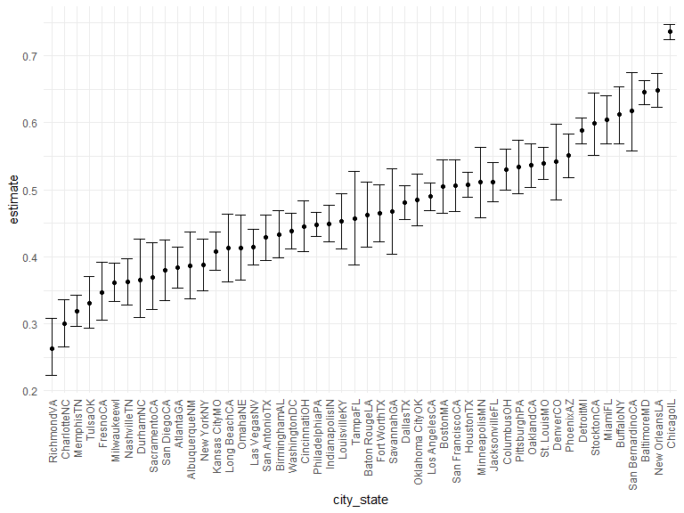
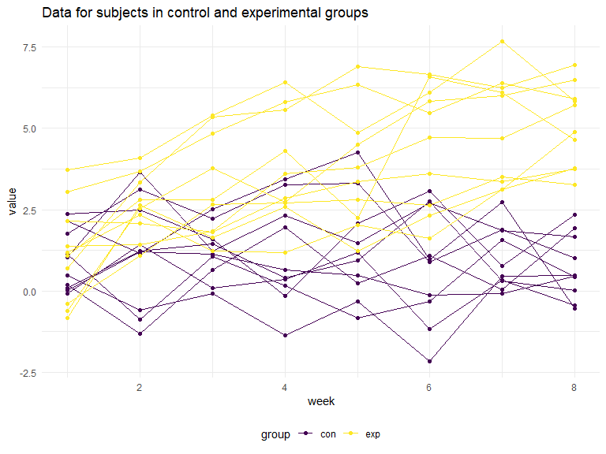

Homework 5
================
Yimiao Pang

## Problem 1

``` r
homicide_df = 
  read_csv("./data/homicide_data.csv", na = c("", "Unknown")) %>% 
  mutate(
    city_state = str_c(city, state),
    resolution = case_when(
      disposition == "Closed without arrest" ~ "unsolved",
      disposition == "Open/No arrest"        ~ "unsolved",
      disposition == "Closed by arrest"      ~ "solved"
    )) %>% 
  relocate(city_state) %>% 
  filter(city_state != "TulsaAL")
```

    ## Rows: 52179 Columns: 12

    ## -- Column specification --------------------------------------------------------
    ## Delimiter: ","
    ## chr (8): uid, victim_last, victim_first, victim_race, victim_sex, city, stat...
    ## dbl (4): reported_date, victim_age, lat, lon

    ## 
    ## i Use `spec()` to retrieve the full column specification for this data.
    ## i Specify the column types or set `show_col_types = FALSE` to quiet this message.

Baltimore

``` r
baltimore_df = 
  homicide_df %>% 
  filter(city_state == "BaltimoreMD")

baltimore_summary = 
  baltimore_df %>% 
  summarize(
    unsolved = sum(resolution == "unsolved"),
    n = n()
  )

baltimore_test = prop.test(
  x = baltimore_summary %>% pull(unsolved),
  n = baltimore_summary %>% pull(n)
)

baltimore_test %>% 
  broom::tidy()
```

    ## # A tibble: 1 x 8
    ##   estimate statistic  p.value parameter conf.low conf.high method    alternative
    ##      <dbl>     <dbl>    <dbl>     <int>    <dbl>     <dbl> <chr>     <chr>      
    ## 1    0.646      239. 6.46e-54         1    0.628     0.663 1-sample~ two.sided

``` r
prop_test_function = function(city_df) {
  city_summary = 
    city_df %>% 
    summarize(
      unsolved = sum(resolution == "unsolved"),
      n = n()
    )
  
  city_test = prop.test(
    x = city_summary %>% pull(unsolved),
    n = city_summary %>% pull(n)
  )
  
  return(city_test)
}


prop_test_function(baltimore_df)
```

    ## 
    ##  1-sample proportions test with continuity correction
    ## 
    ## data:  city_summary %>% pull(unsolved) out of city_summary %>% pull(n), null probability 0.5
    ## X-squared = 239.01, df = 1, p-value < 2.2e-16
    ## alternative hypothesis: true p is not equal to 0.5
    ## 95 percent confidence interval:
    ##  0.6275625 0.6631599
    ## sample estimates:
    ##         p 
    ## 0.6455607

``` r
homicide_df %>% 
  filter(city_state == "AlbuquerqueNM") %>% 
  prop_test_function()
```

    ## 
    ##  1-sample proportions test with continuity correction
    ## 
    ## data:  city_summary %>% pull(unsolved) out of city_summary %>% pull(n), null probability 0.5
    ## X-squared = 19.114, df = 1, p-value = 1.232e-05
    ## alternative hypothesis: true p is not equal to 0.5
    ## 95 percent confidence interval:
    ##  0.3372604 0.4375766
    ## sample estimates:
    ##         p 
    ## 0.3862434

``` r
results_df = 
  homicide_df %>% 
  nest(data = uid:resolution) %>% 
  mutate(
    test_results = map(data, prop_test_function),
    tidy_results = map(test_results, broom::tidy)
  ) %>% 
  select(city_state, tidy_results) %>% 
  unnest(tidy_results) %>% 
  select(city_state, estimate, starts_with("conf"))

results_df %>% 
  mutate(city_state = fct_reorder(city_state, estimate)) %>% #keep it in a right order
  ggplot(aes(x = city_state, y = estimate)) +
  geom_point() +
  geom_errorbar(aes(ymin = conf.low, ymax = conf.high)) +
  theme(axis.text.x = element_text(angle = 90, vjust = 0.5, hjust = 1))
```



``` r
homicide_df %>% 
  group_by(city_state) %>% 
  summarize(
    unsolved = sum(resolution == "unsolved"),
    n = n()
  ) %>% 
  mutate(
    test_results = map2(unsolved, n, prop.test),
    tidy_results = map(test_results, broom::tidy)
  ) %>% 
  select(city_state, tidy_results) %>% 
  unnest(tidy_results) %>% 
  select(city_state, estimate, starts_with("conf"))
```

    ## # A tibble: 50 x 4
    ##    city_state    estimate conf.low conf.high
    ##    <chr>            <dbl>    <dbl>     <dbl>
    ##  1 AlbuquerqueNM    0.386    0.337     0.438
    ##  2 AtlantaGA        0.383    0.353     0.415
    ##  3 BaltimoreMD      0.646    0.628     0.663
    ##  4 Baton RougeLA    0.462    0.414     0.511
    ##  5 BirminghamAL     0.434    0.399     0.469
    ##  6 BostonMA         0.505    0.465     0.545
    ##  7 BuffaloNY        0.612    0.569     0.654
    ##  8 CharlotteNC      0.300    0.266     0.336
    ##  9 ChicagoIL        0.736    0.724     0.747
    ## 10 CincinnatiOH     0.445    0.408     0.483
    ## # ... with 40 more rows

## Problem 2

``` r
all_data_df = 
  tibble(
    filename = list.files(path = "./data/p2_data", full.names = TRUE),
    df = map(.x = filename, ~read_csv(.x))
  ) %>% 
  separate(filename, into = c("dot", "dt", "p2", "file_name"), sep = "/") %>% 
  separate(file_name, into = c("group", "id")) %>% 
  select(group, id, df) %>% 
  unnest(df)

all_data_tidy = 
  all_data_df %>% 
  pivot_longer(
    week_1:week_8,
    names_to = "week",
    values_to = "data"
  ) %>% 
  mutate(
    week = recode(week, 'week_1' = 1, 'week_2' = 2, 'week_3' = 3, 'week_4' = 4, 'week_5' = 5, 'week_6' = 6, 'week_7' = 7, 'week_8' = 8)
    )

all_data_tidy
```

    ## # A tibble: 160 x 4
    ##    group id     week  data
    ##    <chr> <chr> <dbl> <dbl>
    ##  1 con   01        1  0.2 
    ##  2 con   01        2 -1.31
    ##  3 con   01        3  0.66
    ##  4 con   01        4  1.96
    ##  5 con   01        5  0.23
    ##  6 con   01        6  1.09
    ##  7 con   01        7  0.05
    ##  8 con   01        8  1.94
    ##  9 con   02        1  1.13
    ## 10 con   02        2 -0.88
    ## # ... with 150 more rows

``` r
# spaghetti plot
all_data_tidy %>% 
  mutate(group_id = str_c(group, id, sep = "_")) %>% 
  ggplot(aes(x = week, y = data, group = group_id, color = group)) + 
  geom_line() +
  geom_point() + 
  theme_set(theme_minimal() + 
  theme(legend.position = "bottom")) +
  labs(title = "Data for subjects in control and experimental groups",
       y = "value")
```



As the spaghetti plots show, data for subjects in the experimental group
increased in the 8 weeks, while those for subjects in the control group
almost kept in the same level over time. Thus, the experimental arm may
lead to an increasing values of interest compared to the control arm.

## Problem 3

``` r
# load data
set.seed(10)

iris_with_missing = iris %>% 
  map_df(~replace(.x, sample(1:150, 20), NA)) %>%
  mutate(Species = as.character(Species)) %>% 
  janitor::clean_names()

# define a function
fillin_f = function(vec) {
  if (is.numeric(vec)) {
    vec[is.na(vec)] = round(mean(vec, na.rm = TRUE), 1)
  }
  
  if (is.character(vec)) {
    vec[is.na(vec)] = "virginica"
  }
  
  return(vec)
}

iris_filled = map_df(iris_with_missing, fillin_f)

iris_filled
```

    ## # A tibble: 150 x 5
    ##    sepal_length sepal_width petal_length petal_width species
    ##           <dbl>       <dbl>        <dbl>       <dbl> <chr>  
    ##  1          5.1         3.5          1.4         0.2 setosa 
    ##  2          4.9         3            1.4         0.2 setosa 
    ##  3          4.7         3.2          1.3         0.2 setosa 
    ##  4          4.6         3.1          1.5         1.2 setosa 
    ##  5          5           3.6          1.4         0.2 setosa 
    ##  6          5.4         3.9          1.7         0.4 setosa 
    ##  7          5.8         3.4          1.4         0.3 setosa 
    ##  8          5           3.4          1.5         0.2 setosa 
    ##  9          4.4         2.9          1.4         0.2 setosa 
    ## 10          4.9         3.1          3.8         0.1 setosa 
    ## # ... with 140 more rows
